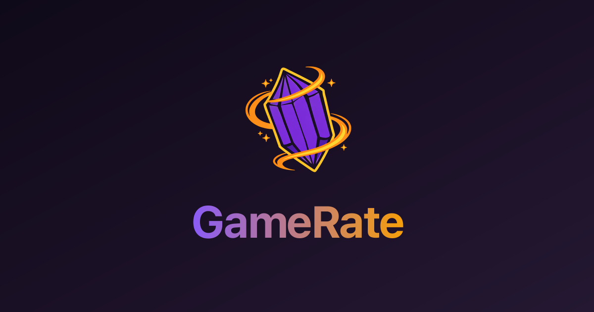
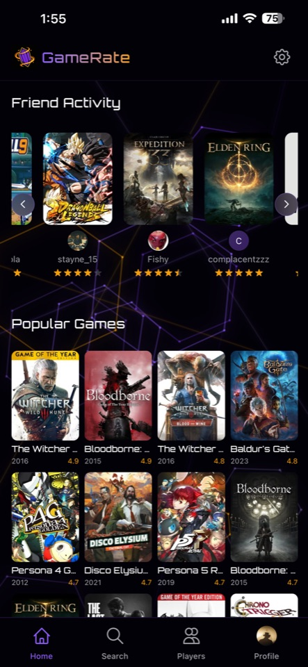
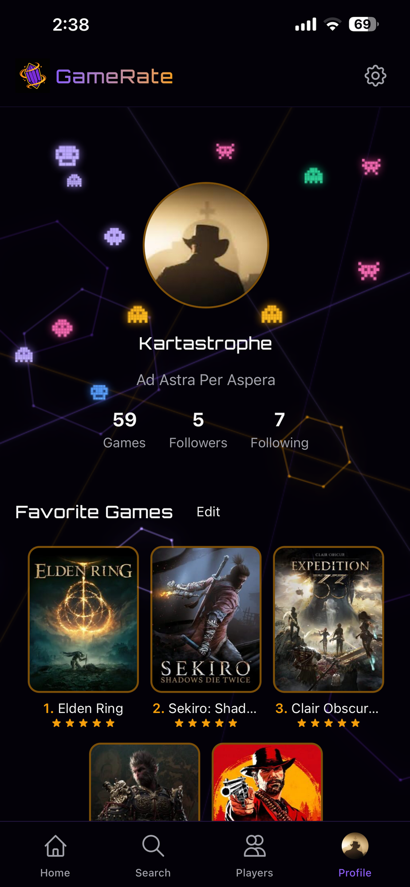
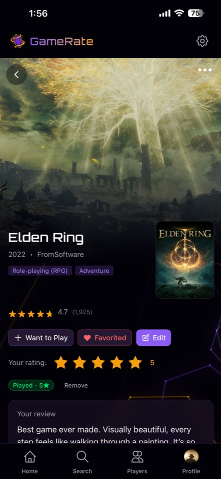
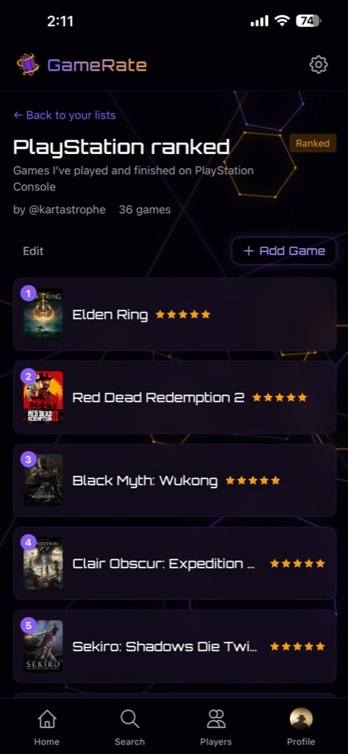

<div align="center">



### Track, Rate & Discover Games

A mobile-first social platform for gamers to rate games, build collections, create lists, and follow friends.

**[Live App](https://gamerate.vercel.app)**

</div>

---

<div align="center">




</div>

## Features

- **Rate Games** — Half-star ratings (0.5 - 5.0) because sometimes a game is more than a 4 but not quite a 5
- **Top 5 Favorites** — Pin your all-time favorites to your profile
- **Custom Lists** — Create ranked or unranked collections like "Best RPGs" or "Hidden Gems"
- **Reviews** — Write and share your thoughts on any game
- **Game Tracking** — Mark games as Played, Playing, Want to Play, or Dropped
- **Social** — Follow friends and see their ratings in your activity feed
- **Browse & Search** — Explore 200,000+ games powered by IGDB, browse by genre
- **Rating Distribution** — See how your ratings break down across your library
- **PWA** — Install on your phone's home screen, launches fullscreen like a native app
- **Responsive** — Mobile-first design with desktop support

## Tech Stack

| Layer | Technology |
|-------|-----------|
| Framework | Next.js 16 (App Router) |
| UI | React 19, Tailwind CSS |
| Language | TypeScript |
| Database | Supabase (PostgreSQL + Row-Level Security) |
| Auth | Supabase Auth |
| Storage | Supabase Storage (avatars) |
| Game Data | IGDB API via Twitch OAuth |
| Hosting | Vercel |
| PWA | Service Worker + Web Manifest |

## Architecture

```
src/
├── app/              # App Router pages & API routes
│   ├── api/          # IGDB proxy, auth, game logs, lists, follows
│   ├── home/         # Authenticated home feed
│   ├── game/         # Game detail pages
│   ├── search/       # Search & genre browsing
│   ├── user/         # Public user profiles
│   ├── lists/        # User lists
│   ├── players/      # Discover users
│   └── settings/     # Account settings
├── components/       # Shared UI components
├── contexts/         # Auth context provider
└── lib/
    ├── igdb/         # IGDB API client & token management
    └── supabase/     # Supabase client (server & browser)
```

---

Built by [Kartastrophe](https://gamerate.vercel.app/user/kartastrophe)
